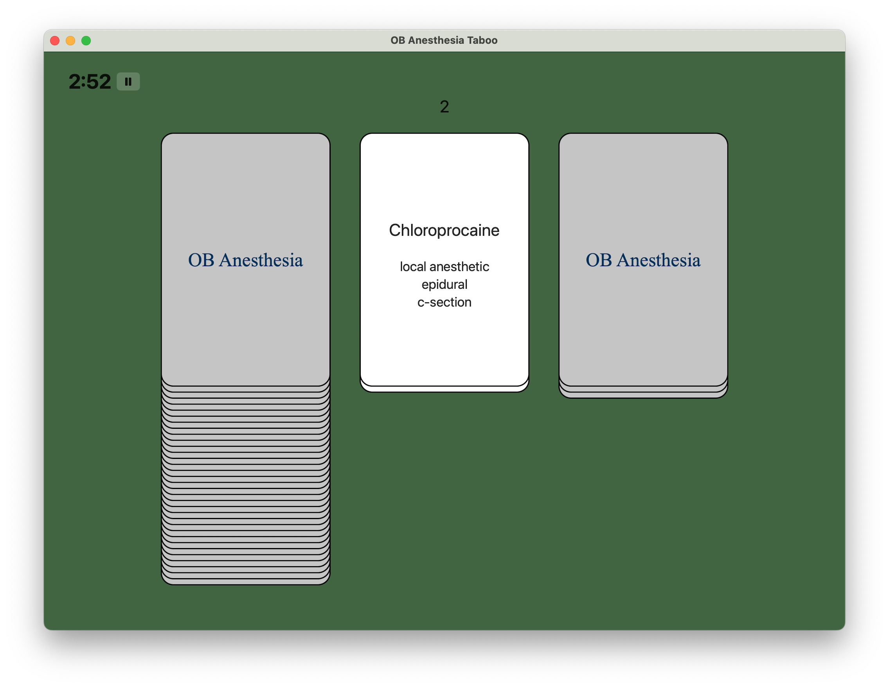

# Word Guessing Game

A Swift Playgrounds App implementing a simple, multi-player, word-guessing game.

## How to Run

Clone/download, then open `Taboo.swiftpm` using the [Playgrounds](https://apps.apple.com/us/app/swift-playgrounds/id1496833156?mt=12) app.

To build an app you can run or share without the editor, click "App Settings" in the sidebar, then
"Install on this Mac".

Probably requires macOS 13 (Ventura).

## How to Play

Players are assigned to teams, and take turns: one player from the team can see the screen,
where a card is turned over to reveal a vocabulary word and several "banned" words.
The player gives clues to help their team-mates guess the vocabulary word. If the word is guessed,
a point is scored. If the clue-giver says any of the "banned" words, no point is scored.

Currently set up for 3:00 turns. The game keeps track of time and how many cards have been turned
over. It's up to you to keep track of score (if you want.)

## The Vocabulary

The current set of words are relevant to Anesthesia residents on their Obstetrics rotation.
If that's not you, feel free to edit [Words.swift](Taboo.swiftpm/Words.swift) with
whatever set of words you want to.
